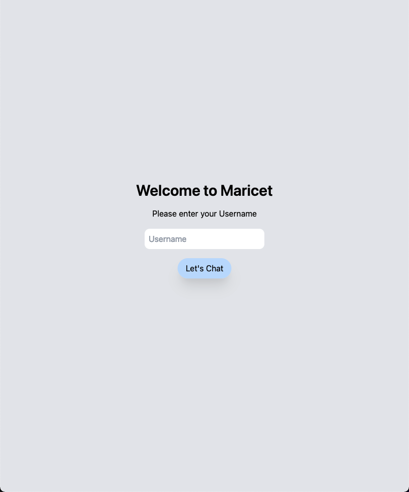

Prasyarat:
- Mengerti dasar pembuatan backend nodejs dengan Express
- Mengerti dasar dari VueJS
- Mengerti penggunaan Vue Router dan VueX
- Sudah menginstall nodejs dan package `vue-cli`

Server


Client
[Inisialisasi - VueJS]
1. vue create .
1. Generate project in current directory? `(Y)es`
1. Please pick a preset: `Manually select features`
1. Check the features needed for your project:
    - Babel
    - Router
    - Vuex
    - Linter / Formatter
1. Choose a version of Vue.js: `2.x`
1. Use history mode for router? `(Y)es`
1. Pick a linter / formatter config: `ESLint with error prevention only`
1. Pick additional lint features: `Lint on save`
1. Where do you prefer placing config? `In dedicated config files`
1. Save this as a preset for future projects? `(N)o`
1. Menunggu selesai mengunduh file yang ada
1. Menambahkan tailwind dengan `vue add tailwind`
1. Generate tailwind.config.js? `minimal`
1. Menunggu selesai generate file tambahan

[Modifikasi Template Starter]
Selanjutnya kita akan memodifikasi file yang ada sehingga bisa sesuai dengan apa yang akan dibuat pada pembelajaran kali ini.
1. Menghapus file `src/components/HelloWorld.vue`
1. Menghapus file `src/views/About.vue` dan `src/views/Home.vue`
1. Memodifikasi file `src/router/index.js` menjadi sebagai berikut:
    ```js
    ...
    // Bagian ini dikomen saja karena sudah tidak digunakan lagi
    // import Home from '../views/Home.vue'

    // Routes dikosongkan saja karena nanti kita akan menambahkan routes
    // seiring pembelajaran ini
    const routes = [];

    ...
    ```
1. Membuka file `tailwind.config.js`
1. Menambahkan konfigurasi berikut pada `theme` -> `extend`
    ```js
    module.exports = {
      ...
      theme: {
        extend: {
          minHeight: {
            'minus-nav': '90vh',
          },
        },
      },
      ...
    ```
1. Membuka pada browser tautan berikut `https://play.tailwindcss.com/sq9f022muH`
1. Membuka file `src/App.vue`
1. Copy seluruh html yang ada pada `play tailwindcss` ke dalam tag `template` pada file `src/App.vue` dan kosongkan tag `<style>` yang ada di `src/App.vue`.
1. Menjalankan dan melihat apa yang terjadi pada starter template ini dengan menggunakan perintah `npm run serve`
1. Apabila semuanya tercopy dan termodifikasi dengan baik, hasil tampilan saat ini adalah sebagai berikut:   
<!--  -->

[Memecah File Template]
1. Membuat dua buah file pada folder `src/views` dengan nama `LoginPage.vue` dan `ChatPage.vue`
1. Pada `LoginPage.vue` dan `ChatPage.vue`, buatlah sebuah struktur awal dari VueJS Component sebagai berikut: 
    ```html
    <template>
      
    </template>

    <script>
    export default {

    }
    </script>

    <style>

    </style>
    ```
1. Melakukan cut dari `src/App.vue`, pada bagian dengan tanda `<!-- Login Page -->` sampai dengan `<!-- End of Login Page -->` dan paste ke dalam `src/views/LoginPage.vue`, sekaligus menambahkan pada tag `<script>` pada file `src/views/LoginPage.vue` sehingga menjadi seperti di bawah
    ```js
    export default {
      name: "LoginPage",
    };
    ```
1. Melakukan cut dari `src/App.vue` pada bagian dengan tanda `<!-- Home Page -->` sampai dengan `<!-- End of Home Page -->` dan paste ke dalam `src/views/ChatPage.vue`, sekaligus menambahkan pada tag `<script>` pada file `src/views/ChatPage.vue` sehingga menjadi seperti di bawah
    ```js
    export default {
      name: "ChatPage",
    };
    ```
1. Apabila semuanya tercopy dengan baik, hasil tampilan saat ini adalah berupa layar abu abu saja.

[Menambahkan Router]
1. Membuka file `src/router/index.js` dan memodifikasi file sehingga menjadi seperti di bawah.
    ```js
    import Vue from "vue";
    import VueRouter from "vue-router";
    // import Home from "../views/Home.vue";

    // Import page yang sudah dibuat
    import LoginPage from "../views/LoginPage.vue";
    import ChatPage from "../views/ChatPage.vue";

    Vue.use(VueRouter);

    const routes = [
      // Deklarasi routes untuk home / chat page
      {
        path: "/",
        name: "Chat",
        component: ChatPage,
      },
      // Deklarasi routes untuk login page
      {
        path: "/login",
        name: "Login",
        component: LoginPage,
      },
    ];

    const router = new VueRouter({
      mode: "history",
      base: process.env.BASE_URL,
      routes,
    });

    // Navigation Guard supaya bisa masuk ke Login Page terlebih dahulu
    router.beforeEach((to, from, next) => {
      // Pada saat orang sudah login, namanya akan disimpan pada localStorage juga
      // sebagai penanda apakah sudah masuk atau belum
      if (!localStorage.getItem("username") && to.name === "Chat") {
        // Apabila belum ada, akan dipaksa menuju halaman Login
        next({ name: "Login" });
      } else {
        next();
      }
    });

    export default router;
    ```
1. Membuka file `src/App.vue` dan menambahkan `<router-view>` di dalam `<div class="container ...">`
    ```html
    <template>
      <div class="container p-4 min-w-full min-h-screen bg-gray-200">
        <!-- Tambahkan router-view di sini -->
        <router-view></router-view>
      </div>
    </template>
    ```
1. Apabila semuanya tercopy dengan baik, hasil tampilan saat ini seharusnya sudah menjadi sama seperti yang awal template kita tadi, namun tanpa halaman chatnya. (hanya halaman login saja)